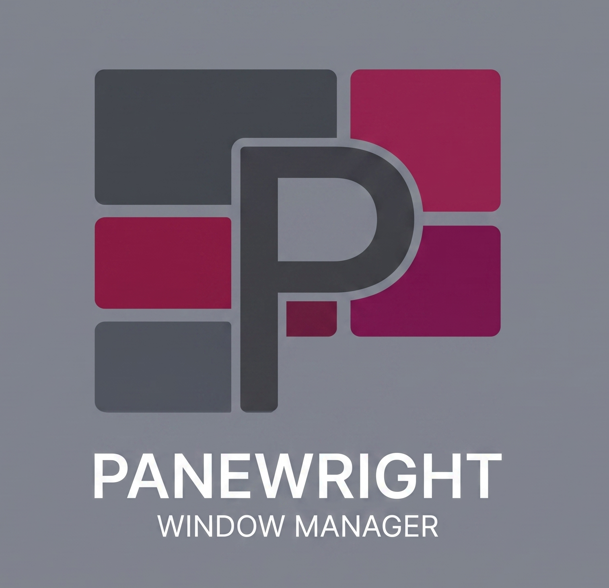

<p align="center">
  
</p>

<h1 align="center">Panewright</h1>
<p align="center"><b>Truly tiled windows for macOS.</b> i3's brain, the Mac's manners.</p>
<p align="center">
  <a href="https://github.com/nitschw/Panewright/releases">Download</a> ·
  <a href="https://panewright.com">panewright.com</a> ·
  <a href="DESIGN.md">Design doc</a> ·
  <a href="https://patreon.com/panewright">Patreon</a>
</p>

---

Panewright is an i3-grade tiling window manager experience for macOS —
instant virtual workspaces, vim-keys navigation, modal keybindings,
scratchpad, per-app rules — delivered as **one menu bar app reading one
config file**, with the platform's manners intact: native window chrome,
no SIP disable, and a quit that restores your Mac to stock.

It orchestrates best-in-class open primitives —
[AeroSpace](https://github.com/nikitabobko/AeroSpace) (tiling),
[JankyBorders](https://github.com/FelixKratz/JankyBorders) (focus borders),
[SketchyBar](https://github.com/FelixKratz/SketchyBar) (status bar) —
so you configure one system, not three.

## The headline: ghost drag-to-tile

Drag a tiled window by its title bar and **the window doesn't move**. A red
ghost marks the cell it came from; a blue ghost previews where it lands —
drop on a window's center to swap, on an edge to split its cell, on a
workspace number in the bar to send it there, on nothing to cancel. The
tree reshapes on release, in one motion. No other macOS tiler has this.

## Everything else

- **Ten instant workspaces** (1–9, 0) — virtual, not macOS Spaces: zero
  animation, drag-a-window-onto-the-bar-number support; **empty workspaces
  hide** until occupied, i3-style
- **True multi-monitor** — a status bar on *every* display (with an `M1`/`M2`
  monitor badge, primary always `M1`) showing only that monitor's workspaces,
  independent per-monitor switching, i3-style **summon** (`$mod+N` pulls the
  workspace to your monitor), drag windows **across displays** (drop on a
  window there, or on empty screen to send it over), and workspaces
  **auto-distributed** as you plug and unplug displays
- **i3 muscle memory** — `$mod+hjkl` focus/move, modal **resize** and
  **join** modes with a live mode badge in the bar, fullscreen/float
  toggles, `$mod+minus` scratchpad, flatten-tree panic button
- **Your choice of `$mod`** — Karabiner hyper key, Ctrl-Opt, Cmd, or a
  tmux-style leader prefix (write it naturally — a chord like ``cmd+` `` is
  normalized to AeroSpace syntax for you); focus-follows-mouse optional
- **One TOML config, live** — save and the desktop follows in under a
  second; or use the **visual editor** (gap sliders reshuffle your windows
  in real time, color pickers drive the borders and bar accent)
- **i3 config importer** — reads your real `~/.config/i3/config`,
  translates bindings/modes/gaps/colors/scratchpad, and flags every
  untranslatable line with a line number and a reason. Never silent.
- **Profiles** — snapshot full configs by name, switch from the menu
- **Status bar** — clickable workspace numbers with accent highlight, mode
  badge, front app; one per monitor, each scoped to its own display;
  native-vibrancy or square-monospace "technical" theme, one toggle apart
- **Built-in cheat sheet** — `$mod+?` pops a window listing every binding in
  *your* config (not a stock list), plus the drag zones and bar interactions
- **A real off switch** — quitting stops the daemons, un-parks every
  hidden window, and leaves macOS exactly as Apple shipped it

## Install

```sh
brew install --cask nikitabobko/tap/aerospace   # tiling engine (required)
brew install FelixKratz/formulae/borders        # focus borders (optional)
brew install FelixKratz/formulae/sketchybar     # status bar (optional)
brew install --cask karabiner-elements          # Caps Lock as $mod (optional)
```

Prefer no extra software? macOS can remap Caps Lock to Control or Option
natively (System Settings → Keyboard → Modifier Keys); pair that with
`modifier = "ctrl"` or `"alt"`.

Then grab [the latest release](https://github.com/nitschw/Panewright/releases),
drop `Panewright.app` in Applications, and launch. The built-in setup
checklist walks through the two permission grants (Accessibility for
AeroSpace; Accessibility + Input Monitoring for Panewright's drag engine)
and can install any missing tools itself — no terminal required.

Coming from i3?

```sh
panewright-dev import ~/.config/i3/config
```

## Building from source

```sh
swift build && swift test        # library + 94 tests
Scripts/bundle.sh release        # → build/Panewright.app (signed if you have a dev cert)
Scripts/release.sh 0.1.0         # full release: version, zip, appcast, tag, GH release
```

macOS 14+, Swift 6. The config model, parsers, emitters, and importer live
in `PanewrightCore` (fully unit-tested, CI on every push); the menu bar
app, drag engine, and editor in `PanewrightApp`.

## Philosophy

Read [DESIGN.md](DESIGN.md) — positioning, the wrap-don't-rewrite
architecture, the licensing rules (MIT here; GPL tools stay out-of-process),
the drag-to-tile spec, and the long-term path to a fully self-contained app.

## License

[MIT](LICENSE) © 2026 William Nitsch. Fully open source, no paywall, no
gated features. Building this costs evenings and weekends — if Panewright
earns a spot in your day, consider
[buying me a coffee](https://patreon.com/panewright).
