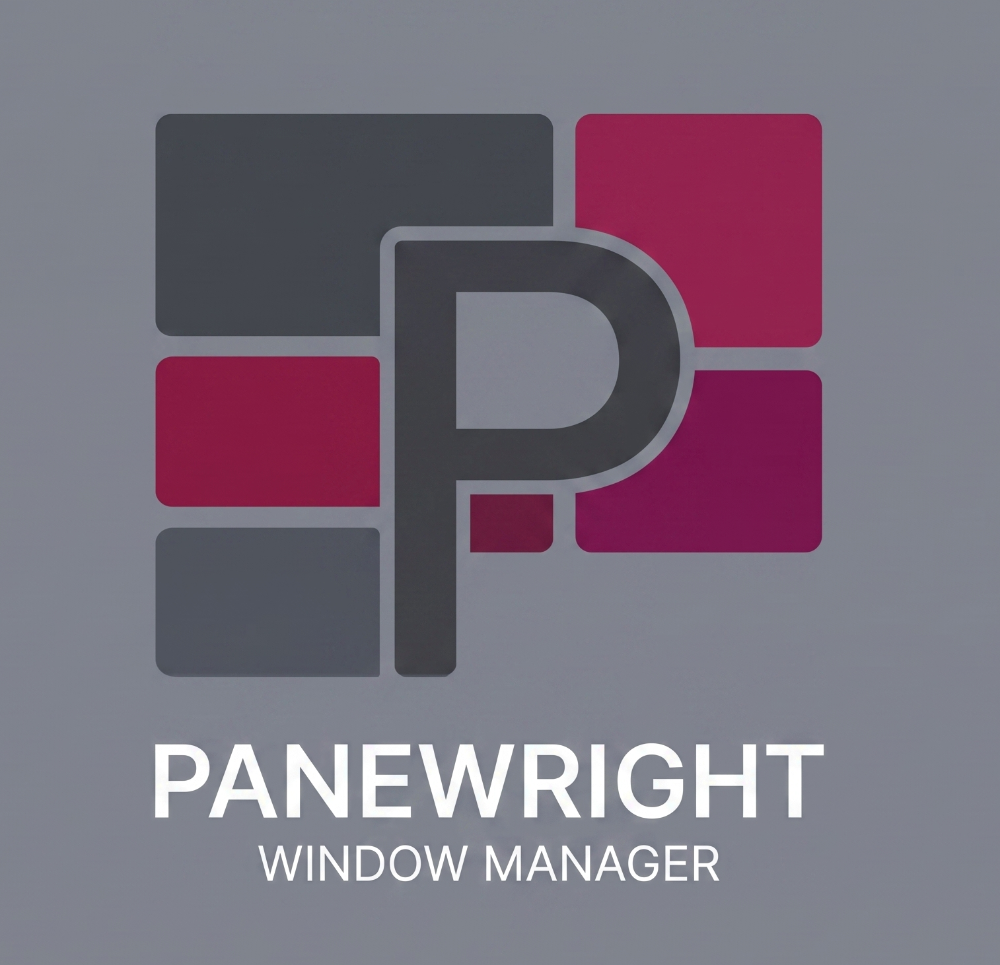

<p align="center">
  
</p>

<h1 align="center">Panewright</h1>
<p align="center"><b>An i3-style tiling window manager for macOS</b> — for developers who miss i3.</p>
<p align="center">
  <code>brew install nitschw/tap/panewright</code>
</p>
<p align="center">
  <a href="https://panewright.com">panewright.com</a> ·
  <a href="DESIGN.md">Design doc</a> ·
  <a href="https://patreon.com/panewright">Patreon</a>
</p>

---

Panewright is an i3-grade tiling window manager experience for macOS —
instant virtual workspaces, vim-keys navigation, modal keybindings,
scratchpad, per-app rules — delivered as **one menu bar app reading one
config file**, with the platform's manners intact: native window chrome,
no SIP disable, and a quit that restores your Mac to stock.

The tiling engine — Panewright's own build of
[AeroSpace](https://github.com/nikitabobko/AeroSpace) — **ships inside the
app** and runs under Panewright's single permission grant, so there is one
app to install and one row in System Settings. The visual layer is
best-in-class open primitives, orchestrated:
[JankyBorders](https://github.com/FelixKratz/JankyBorders) (focus borders)
and [SketchyBar](https://github.com/FelixKratz/SketchyBar) (status bar).
You configure one system, not three.

**Isn't this just AeroSpace?** AeroSpace is a great, free i3-like tiler, and
Panewright's engine is a build of it (patches
[in the open](https://github.com/nitschw/AeroSpace/tree/panewright)).
Panewright is everything on top: the drag-to-tile interaction no CLI tiler
has, automatic overlap rescue for apps that refuse to shrink, one live
config, a visual editor, work-tracker integrations, and a supervisor that
respawns a dead engine and puts every window back on its workspace
afterwards. Rather run the raw tools by hand? Fair choice — and since
Panewright is MIT, you can read exactly how it does all of it.

## The headline: ghost drag-to-tile

Drag a tiled window by its title bar and **the window doesn't move**. A red
ghost marks the cell it came from; a blue ghost previews where it lands —
drop on a window's center to swap, on an edge to split its cell, on a
workspace number in the bar to send it there, on nothing to cancel. The
tree reshapes on release, in one motion. No other macOS tiler has this.

## Everything else

- **Ten instant workspaces** (1–9, 0) — virtual, not macOS Spaces: zero
  animation, drag-a-window-onto-the-bar-number support; **empty workspaces
  hide** until occupied, i3-style
- **True multi-monitor** — a status bar on *every* display (with an `M1`/`M2`
  monitor badge, primary always `M1`) showing only that monitor's workspaces,
  independent per-monitor switching, i3-style **summon** (`$mod+N` pulls the
  workspace to your monitor), drag windows **across displays** (drop on a
  window there, or on empty screen to send it over), and workspaces
  **auto-distributed** as you plug and unplug displays
- **i3 muscle memory** — `$mod+hjkl` focus/move, modal **resize** and
  **join** modes with a live mode badge in the bar, fullscreen/float
  toggles, `$mod+minus` scratchpad, flatten-tree panic button
- **Your choice of `$mod`** — Karabiner hyper key, Ctrl-Opt, Cmd, or a
  tmux-style leader prefix (write it naturally — a chord like ``cmd+` `` is
  normalized to AeroSpace syntax for you); focus-follows-mouse optional
- **One TOML config, live** — save and the desktop follows in under a
  second; or use the **visual editor** (gap sliders reshuffle your windows
  in real time, color pickers drive the borders and bar accent)
- **i3 config importer** — reads your real `~/.config/i3/config`,
  translates bindings/modes/gaps/colors/scratchpad, and flags every
  untranslatable line with a line number and a reason. Never silent.
- **Profiles** — snapshot full configs by name, switch from the menu
- **Built-in cheat sheet** — `$mod+?` pops a window listing every binding in
  *your* config (not a stock list), plus the drag zones and bar interactions
- **Overlap rescue** — macOS apps have minimum sizes and refuse to shrink
  past them, which is how "tiling" quietly stops being tiling. Panewright
  measures the real frames, learns each app's floor, and escalates:
  shrink what has room, then **stack two columns** rather than crush
  anything, and only then move a window out — telling you why
- **Survives everything** — the engine is supervised and respawned, window
  → workspace assignments are snapshotted continuously and restored after
  any engine restart, and the bar heals its own ordering; opening your
  laptop lid is not an event
- **Status bar, your way** — clickable workspace numbers, mode badge, and
  front app, one bar per monitor scoped to its own display; bottom or top
  edge, thickness, text size, opacity, show-over-fullscreen; native-vibrancy
  or square-monospace "technical" theme; it dodges the Dock on any edge
  automatically
- **A real off switch** — quitting stops the daemons, un-parks every
  hidden window, and leaves macOS exactly as Apple shipped it

## Install

```sh
brew trust nitschw/tap                # Homebrew requires this for third-party casks
brew install nitschw/tap/panewright   # Panewright + engine, borders, status bar
```

That's the whole install — the tiling engine is built in, and the cask
pulls in the borders and the bar. Launch Panewright and the setup
checklist walks through the one permission step (Accessibility + Input
Monitoring, both for Panewright itself — the engine runs under its
grant). Already running AeroSpace separately? Uninstall it first; two
engines fight over the same windows.

Want Caps Lock as `$mod` without extra software? macOS remaps Caps Lock
to Control or Option natively (System Settings → Keyboard → Modifier
Keys); pair that with `modifier = "ctrl"` or `"alt"`. For a true hyper
key, `brew install --cask karabiner-elements`.

Updates arrive through the app itself (Sparkle, signed); brew knows this
and won't nag.

Coming from i3?

```sh
panewright-dev import ~/.config/i3/config
```

## Building from source

```sh
swift build && swift test        # library + 300-odd tests
Scripts/bundle.sh release        # → build/Panewright.app (signed if you have a dev cert)
Scripts/release.sh 0.5.0         # full release: version, zip+dmg, appcast, tag, GH release, tap
```

macOS 14+, Swift 6. The config model, parsers, emitters, window-fitting
logic, and importer live in `PanewrightCore` (fully unit-tested, CI on
every push); the menu bar app, drag engine, and editor in `PanewrightApp`.
The engine patches live as a branch of
[nitschw/AeroSpace](https://github.com/nitschw/AeroSpace/tree/panewright)
with mirrors in `Patches/`; `bundle.sh` embeds the engine build when the
fork checkout is present and falls back to a separately installed
AeroSpace otherwise.

## Philosophy

Read [DESIGN.md](DESIGN.md) — positioning, the wrap-don't-rewrite
architecture, the licensing rules (MIT here; GPL tools stay out-of-process),
the drag-to-tile spec, and the long-term path to a fully self-contained app.

## License &amp; pricing

The **core is [MIT](LICENSE)** © 2026 William Nitsch — build it from source
and run it free, forever. A paid app is planned for the convenience layer: a
signed, notarized, auto-updating build plus the work-tracker integrations.
Open the roads, sell the car. Until then, if the project earns a spot in your
day, [buy me a coffee](https://patreon.com/panewright).
